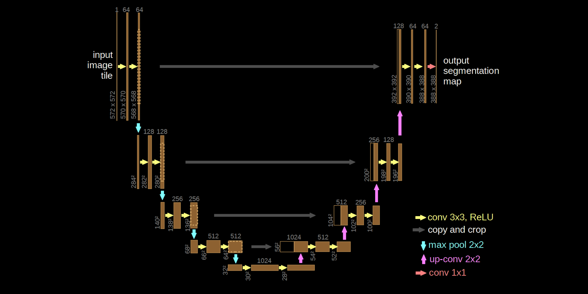

# UNet in JAX & Equinox
Simple 1d UNet in JAX &amp; Equinox to solve the Poisson equation.

This tutorial uses hierarchical (multi-grid) structure to learn a solver to a 1d
Poisson problem. In this scenario, one can think of the Poisson PDE as
describing the relation between the force applied to a thin string/membrane, and
its deformation.

📺 [Here](https://youtu.be/dqpA3Z86qkI) you can find a video with detailed explanations to code along.

💽 Want more Machine Learning & Simulation? Check out [this
repo](https://github.com/Ceyron/machine-learning-and-simulation) with more codes
and handwritten notes.

### About UNets

UNets are hierarchical convolutional networks that operate on multiple different
spatial resolutions. In the left part, they trade spatial resolution for feature
(=channel) count. In the lowest levels, even simple 3x3 convolutions have a very
wide receptive field. This is crucial to solve elliptic PDEs like the Poisson
equation.
